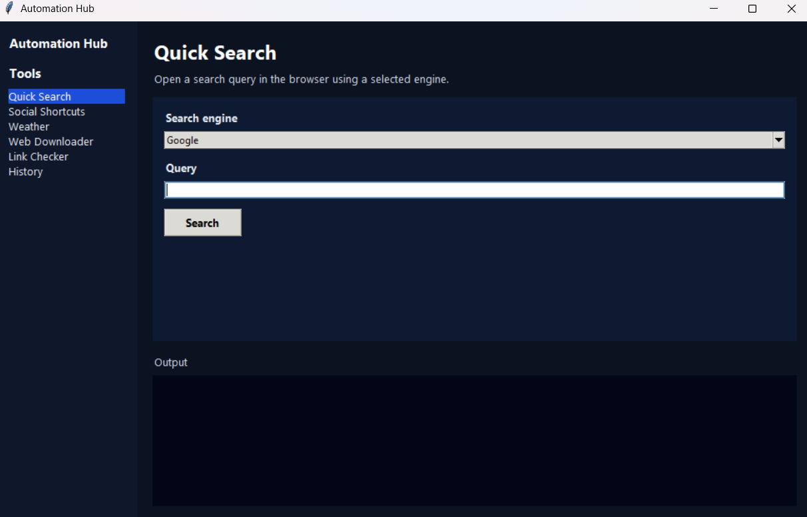
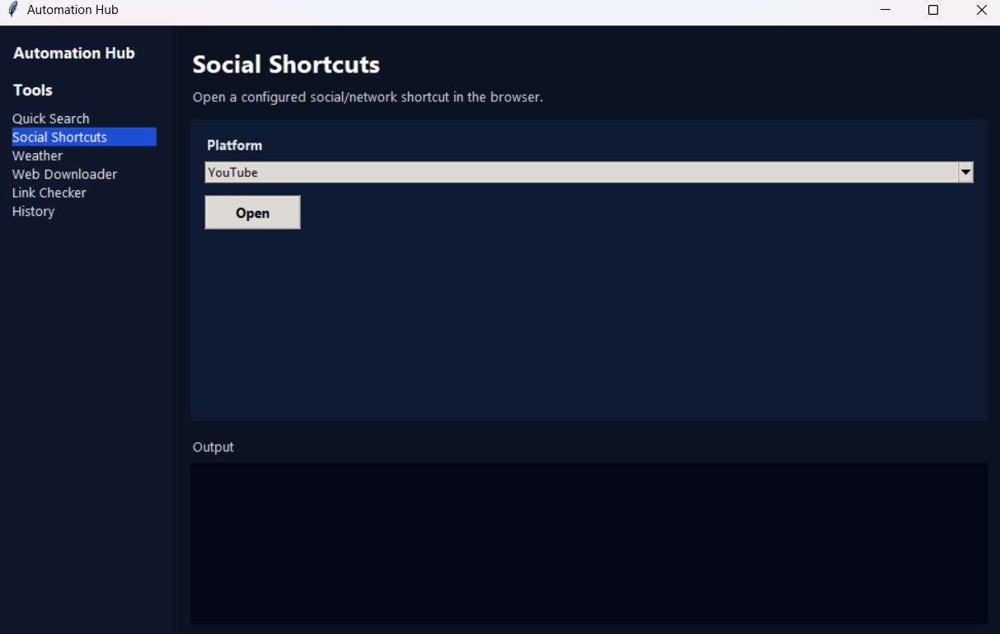
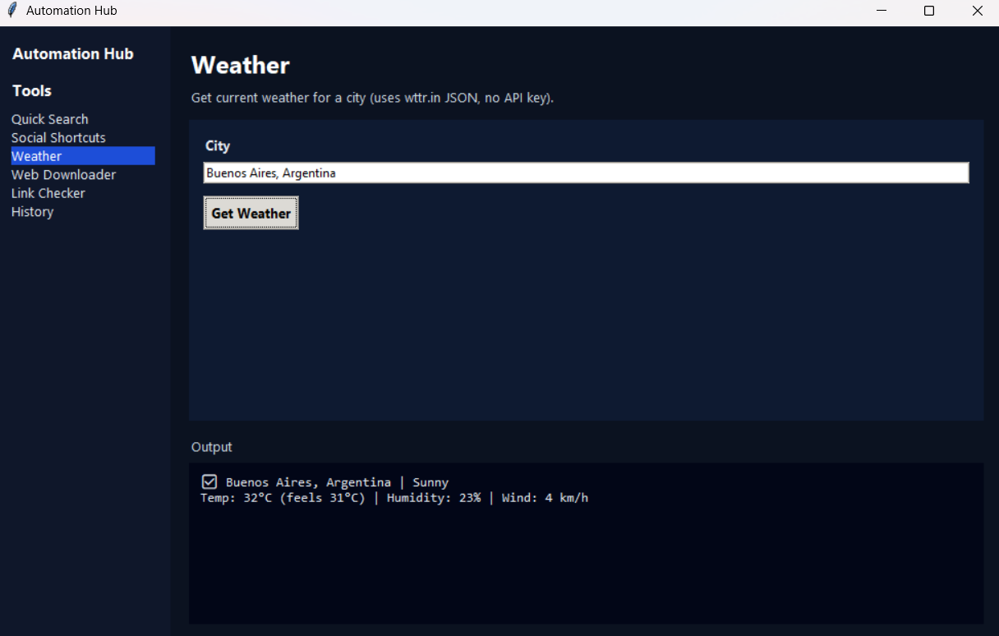
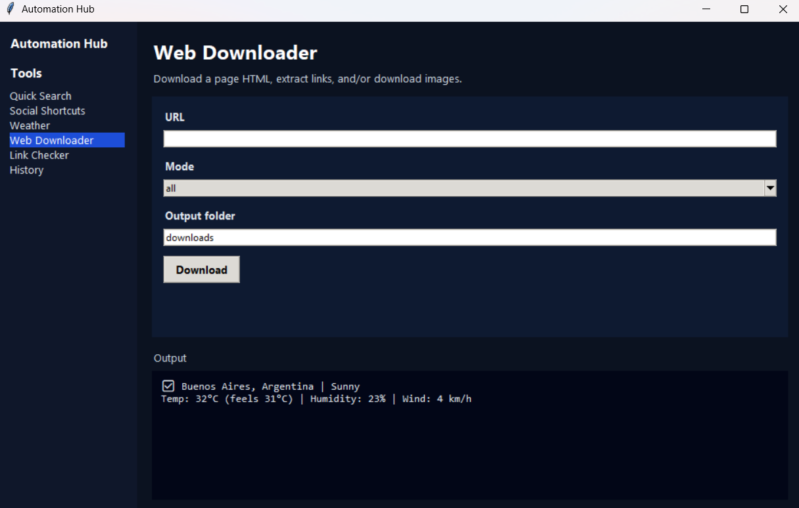
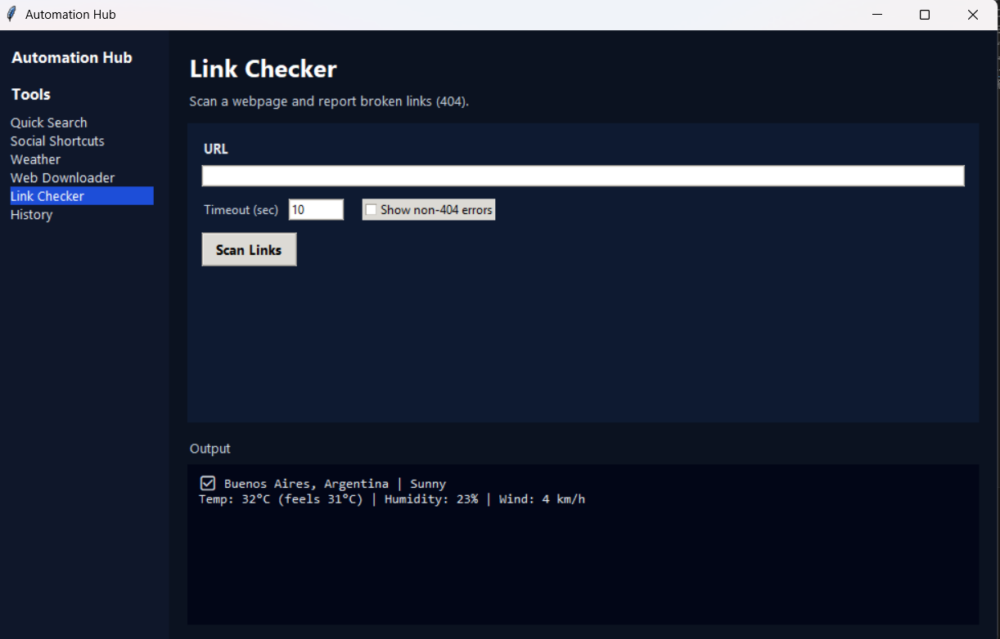

# Automation Hub


Desktop automation toolkit built with Python and Tkinter.  
Includes web search, social shortcuts, weather lookup, link checker, and web downloader.


---

## Screenshots

### Quick Search  


### Social Shortcuts  


### Weather  


### Web Downloader  


### Link Checker  


### History  


---

## Download the latest version:
https://github.com/Lautarocuello98/automation-hub/releases/latest

## Features

### Quick Search
Search instantly using configured engines such as:
- Google  
- YouTube  
- GitHub  
- Google Maps  

### Social Shortcuts
Open frequently used platforms with one click.  
Configurable through `config.json`.

### Weather Tool
Retrieve current weather information for a city.

### Web Downloader
Download:
- Full HTML pages  
- All links from a page  
- Images from a page  

### Link Checker
Scan a webpage and detect broken links (404 errors).

### History System
The application automatically:
- Stores executed actions
- Saves results and parameters
- Allows deleting individual entries or clearing history

### Keyboard Workflow
- Press **Enter** to execute actions
- Press **Delete** in History to remove selected entries

---

## Technologies Used

- Python  
- Tkinter  
- Requests  
- BeautifulSoup  
- JSON  
- Logging  
- Dataclasses  

---

## Project Architecture

The application is structured to separate responsibilities:

```
GUI Layer (app.py)
        ↓
Tool Interface
        ↓
Individual Tools (tools/)
```

Each tool:
- Implements a common `Tool` contract (`run(params) -> Result`)  
- Uses predictable `ToolError` exceptions for validation/network failures    
- Handles its own logic independently  

This allows:
- Easy extension  
- Clean debugging  
- Scalable design  

---

## Project Structure

```
automation_hub/
│
├── screenshots/          # Application screenshots
│
├── tools/
│   ├── __init__.py
│   ├── base.py
│   ├── errors.py
│   ├── types.py
│   ├── quick_search.py
│   ├── social_shortcuts.py
│   ├── weather.py
│   ├── web_downloader.py                 
│   └── link_checker.py
│
│
├── tests/
│   ├── test_imports.py
│   └── test_tools_contract.py
│
│
├── app.py                # Main GUI application
├── config.json           # User configuration
├── history.json          # Execution history
├── app.log               # Runtime logs
├── requirements.txt
├── README.md
|── .gitignore
|── LICENSE
└── pytest.ini

```

---

## Installation

Installation:
```
python -m venv .venv
```

Windows (PowerShell):
```
.venv\Scripts\Activate.ps1
```

macOS/Linux:
```
source .venv/bin/activate
```

Install dependencies:

```
python -m pip install -r requirements.txt
```

---

## Tests

This project includes basic tests to verify:

- Module imports
- Tool contract behavior
- Stability without requiring internet access

Run tests locally:

```
python -m pip install pytest
pytest
```

Test files are located in:

```
tests/
├── test_imports.py
└── test_tools_contract.py
```

---


## How to Run

```
python app.py
```

The graphical interface will open automatically.

---

## Configuration

You can edit `config.json` to customize:

- Social media shortcuts  
- Search engines  
- Default download folder  

Example:

```json
{
  "socials": {
    "GitHub": "https://github.com",
    "LinkedIn": "https://linkedin.com"
  },
  "search_engines": {
    "Google": "https://www.google.com/search?q={query}"
  },
  "download_folder": "downloads"
}
```

---

## Logging

The application generates a log file:

```
app.log
```

Used for:
- Debugging  
- Error tracking  
- Execution records  

---

## Key Concepts Demonstrated

- Modular program design  
- GUI development with Tkinter  
- HTTP requests and web scraping  
- File handling and downloads  
- Configuration management  
- Handling user history and logging  
- Structuring a multi-module Python application  

---

## License
MIT (see LICENSE). 


## Author

Lautaro Cuello  
Python Developer  

GitHub:  
https://github.com/Lautarocuello98
